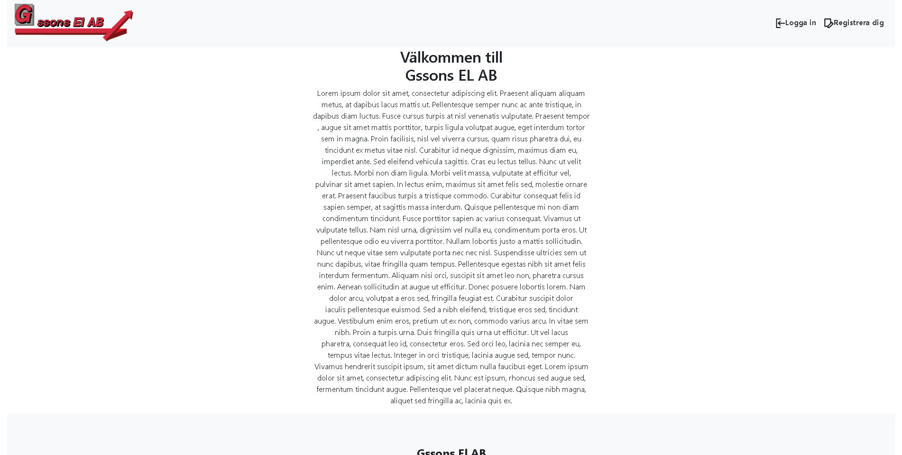

# Intranat

A modern web application built with PHP, TypeScript, and a rich set of development tools.

## [Visit](https://intranet.gssonsel.se.185-133-206-116.bb.kringelstan.se)

## Overview

Intranat is a web application that provides a dashboard interface with user authentication, registration, and password recovery functionality. The project uses modern web technologies and development practices to ensure code quality and maintainability.

## Features

- User authentication and registration system
- Password recovery functionality
- Dashboard interface
- Rich text editor integration (CKEditor 5)
- TypeScript support
- Modern development tooling

## Tech Stack

- **Frontend**: TypeScript, JavaScript, CSS
- **Backend**: PHP
- **Database**: SQL
- **Development Tools**:
  - ESLint for code linting
  - Stylelint for CSS linting
  - Prettier for code formatting
  - TypeScript for type checking
  - Husky for git hooks

## Prerequisites

- Node.js >= 16.0.0
- Yarn package manager
- PHP environment (XAMPP recommended)
- Git

## Installation

1. Clone the repository:
   ```bash
   git clone https://github.com/fadihanna123/Intranat.git
   cd Intranat
   ```

2. Install dependencies:
   ```bash
   yarn setup
   ```

3. Start the development server:
   ```bash
   yarn start
   ```

## Available Scripts

- `yarn setup` - Install all dependencies
- `yarn start` - Start the development server
- `yarn lint` - Run ESLint and Stylelint
- `yarn format` - Format code using Prettier
- `yarn clear` - Remove node_modules
- `yarn type-check` - Run TypeScript type checking

## Project Structure

```
Intranat/
├── Dashboard/         # Dashboard related files
├── CSS/              # Stylesheets
├── js/               # JavaScript files
├── TS/               # TypeScript files
├── Images/           # Image assets
├── Includes/         # PHP includes
├── sql/              # Database related files
```

## Development

The project uses several development tools to maintain code quality:

- ESLint for JavaScript/TypeScript linting
- Stylelint for CSS linting
- Prettier for code formatting
- Husky for git hooks
- TypeScript for type checking

## Contributing

1. Fork the repository
2. Create your feature branch (`git checkout -b feature/amazing-feature`)
3. Commit your changes (`git commit -m 'Add some amazing feature'`)
4. Push to the branch (`git push origin feature/amazing-feature`)
5. Open a Pull Request

## Screenshot



## Author

- **Fadi Hanna** - [GitHub](https://github.com/fadihanna123)

## Support

For support, please open an issue in the [GitHub repository](https://github.com/fadihanna123/Intranat/issues).
